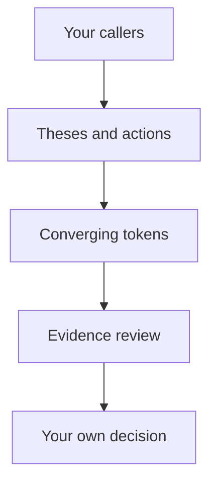

## The problem

Information about a token is scattered across posts, profiles, and wallets. One person may use several accounts. A claim of buying does not prove a purchase, and a displayed profit does not explain when or at what price someone could have reproduced it.

Users spend time reconstructing context: who posted first, why the caller matters, whether they held the token, how their position changed, and who else independently noticed the same idea.

## Klieg's approach

Your circle of callers is the starting point. Choose the people whose ideas you want to research. Klieg brings together their posts and activity, matches tokens by network and address, and lets you move from shared interest to specific evidence.

## Where the value comes from

**Caller context.** Past calls, linked accounts, and the evidence behind wallet associations help you assess an individual thesis.

**Words and actions together.** Buying before a post, buying after it, and subsequently exiting mean different things. Klieg preserves the sequence.

**Converging interests.** Several callers you follow may notice the same token. Their individual theses remain visible; one person with several approved linked accounts should not create the appearance of independent agreement.

**Verifiability.** A conclusion needs its source, timestamp, and limits. An unknown state should stay unknown.

## An example

Two callers in your cohort discuss the same token. The first has a confirmed purchase before the post. For the second, only the thesis is available. Later, the first caller's exit is confirmed. Klieg treats these as separate events with different evidence, all within the token's history.

This helps you ask better questions. It does not prove a caller's motive or turn agreement among several people into a promise of price appreciation.
