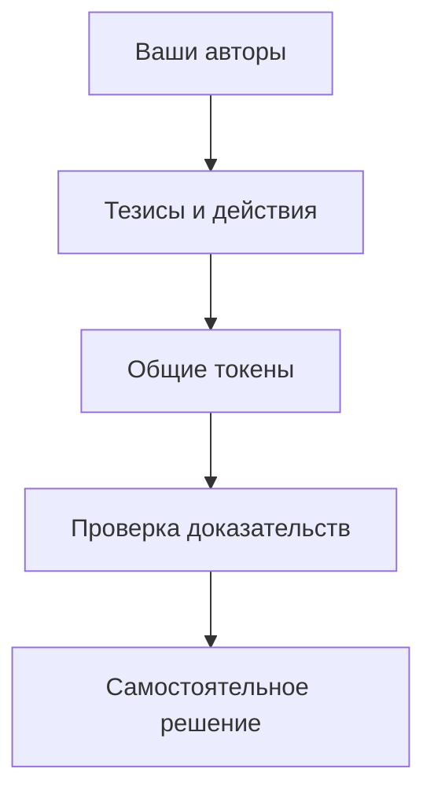

## Проблема

Информация о токене разбросана по публикациям, профилям и кошелькам. Один человек может вести несколько аккаунтов. Сигнал о покупке ещё не доказывает покупку, а показанная прибыль не объясняет, когда и по какой цене можно было повторить результат.

Пользователь тратит время на восстановление контекста: кто написал первым, почему этот автор заслуживает внимания, держал ли он токен, как менялась его позиция и кто ещё независимо обратил внимание на ту же идею.

## Подход Klieg

Отправная точка — ваш круг авторов. Выбирайте трейдеров, чьи идеи хотите исследовать. Klieg собирает относящиеся к ним публикации и действия, сопоставляет токены по сети и адресу и позволяет перейти от общих данных к конкретным доказательствам.

## Что создаёт ценность

**Контекст автора.** История публикаций, связанные аккаунты и основания связи с кошельками помогают оценить конкретный тезис.

**Сопоставление слов и действий.** Покупка до публикации, покупка после неё и последующий выход имеют разный смысл. Klieg сохраняет временную последовательность.

**Пересечение интересов.** Несколько выбранных авторов могут обратить внимание на один токен. Их отдельные тезисы остаются видимыми; один человек с несколькими подтверждённо связанными аккаунтами не должен создавать иллюзию независимого согласия.

**Проверяемость.** Помимо вывода важны происхождение данных, время и пределы доказательства. 

## Пример

Два автора из вашей группы обсуждают один токен. У первого есть подтверждённая покупка до публикации. У второго пока виден только тезис. Позже у первого подтверждается выход. В Klieg это разные события с разными основаниями, которые можно рассмотреть в одной истории токена.

Такой разбор помогает задать более точные вопросы перед принятием решения о входе в сделку. 
